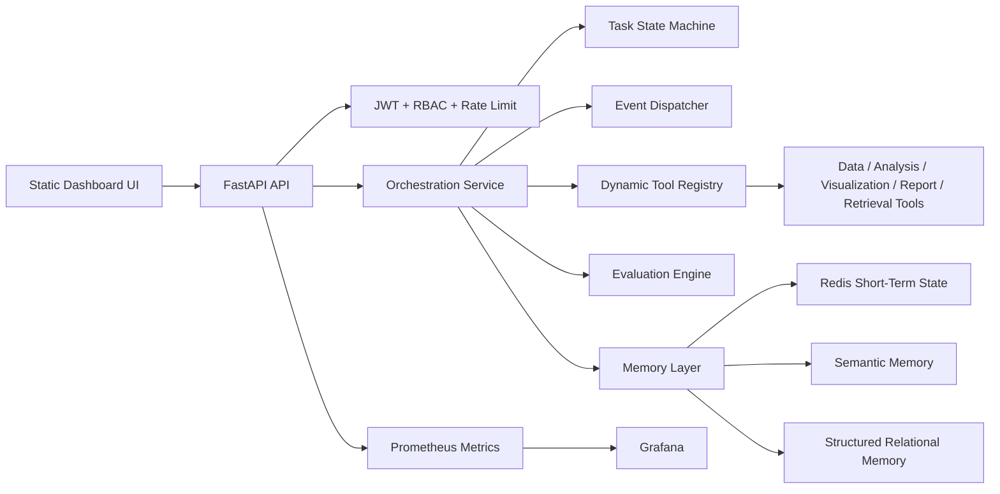
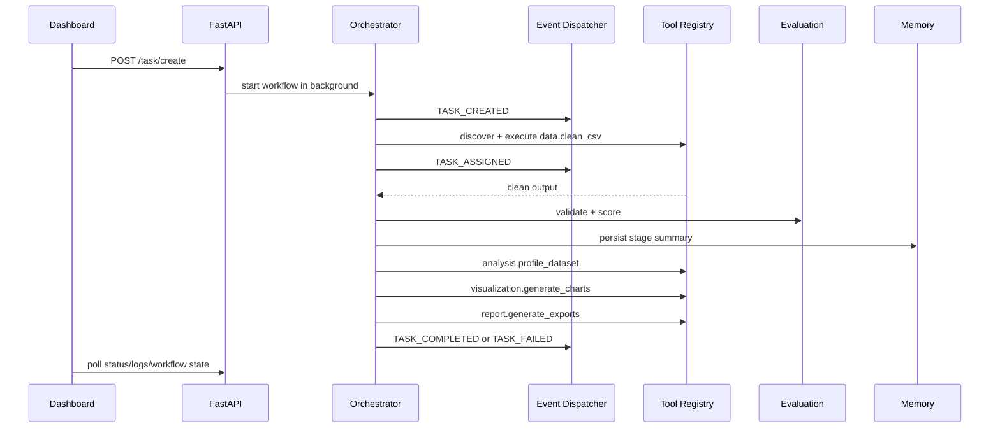

# FlowIQ Production Architecture Upgrade

FlowIQ upgrades the existing FastAPI multi-agent analyst MVP without replacing the working CSV analysis pipeline. The original Data, Analysis, Visualization, and Report agents remain the core workers; the new modules add a production control plane around them.

## 1. Updated Architecture Design



## 2. Folder Structure Improvements

New modules are additive:

```text
backend/
  core/                  runtime settings
  memory/                short-term, semantic, retrieval, embedding pipeline
  tools/                 registry, metadata schemas, execution engine, built-ins
  events/                event models, dispatcher, retry manager, worker hook
  orchestration/         central workflow service, state machine, lifecycle manager
  evaluation/            structural, rule, confidence, groundedness scoring
  observability/         JSON logging and metrics
  security/              audit logging and rate limiting
  domain_agents/         Data, Reporting, Automation, Research adapters
  routes/platform.py     tool, memory, workflow-state APIs
  routes/rag.py          document ingestion and retrieval APIs
  routes/metrics.py      Prometheus endpoint
  monitoring/            Prometheus and Grafana provisioning
```

## 3. Database Schema Recommendations

Existing tables are preserved. New production tables:

| Table | Purpose |
| --- | --- |
| `workflows` | Workflow identity, owner, status, dependency graph |
| `tasks` | Existing task metadata plus state, retry, confidence, validation, timestamps |
| `agent_lifecycle` | Per-agent state, confidence, validation status, timestamps |
| `event_logs` | Durable event audit trail |
| `tool_execution_records` | Tool calls, latency, status, input/output summaries |
| `memory_records` | Relational index of semantic/structured memory writes |
| `evaluation_records` | Scores, reasoning summaries, validation errors |
| `retry_records` | Retry attempts and reasons |
| `performance_metrics` | Persisted operational metrics |
| `audit_logs` | Security and permission audit events |

Recommended next step: replace `create_all` schema evolution with Alembic migrations before production.

## 4. Event Flow Diagram



## 5. Agent Interaction Design

The Planner role is no longer responsible for infrastructure orchestration. The centralized orchestration service owns scheduling, state transitions, retries, timeouts, and agent/tool allocation.

Specialized agents:

| Agent | Capabilities |
| --- | --- |
| Data Agent | CSV cleaning, preprocessing, EDA foundation |
| Reporting Agent | Chart and export generation |
| Automation Agent | Generic workflow/tool execution |
| Research Agent | Semantic retrieval and future web research |

## 6. API Endpoint Recommendations

Implemented:

| Endpoint | Purpose |
| --- | --- |
| `POST /task/create` | Backward-compatible workflow launch |
| `GET /task/{id}/status` | Status plus state, retries, validation, confidence |
| `GET /platform/tools` | Tool capability discovery |
| `POST /platform/tools/execute` | Permission-checked dynamic tool execution |
| `POST /platform/memory/search` | Semantic memory search |
| `GET /platform/workflow/{id}/state` | Task state, agent lifecycle, events, evaluations |
| `POST /rag/ingest` | CSV/PDF/DOCX/TXT ingestion |
| `POST /rag/search` | Context retrieval |
| `GET /metrics` | Prometheus scrape target |

Recommended SaaS additions: organizations, projects, API keys, webhook subscriptions, usage billing, async export jobs, and OAuth app connectors.

## 7. Queue Workflow Design

Current compatibility mode keeps the existing background-thread task launch. The event dispatcher persists events and can push to Redis when `ENABLE_REDIS_QUEUE=true`.

Production migration:

1. API validates input and writes task row.
2. API publishes `TASK_CREATED`.
3. Worker consumes from Redis/Celery.
4. Worker calls `OrchestrationService.run_analysis_workflow`.
5. Failed jobs enter retry/failure queues with `RetryRecord`.

## 8. Memory Management Strategy

Short-term memory:

- Redis key: `session:{workflow_id}:context`
- TTL controlled by `SHORT_TERM_TTL_SECONDS`
- Stores active workflow context and live stage events

Semantic memory:

- Local hashing-vector store by default for zero-config development
- ChromaDB/FAISS can replace the backend behind the same `SemanticMemory` interface
- Stores task history, uploads, execution outputs, and reasoning summaries

Structured memory:

- PostgreSQL tables store durable users, workflows, tasks, execution records, events, metrics, retries, and audits

## 9. Security Architecture

Implemented:

- JWT access/refresh flow
- Role guard for admin routes
- Tool-level permissions
- Rate limit middleware
- Audit logging
- Input/output schema validation for tools

Recommended before public deployment:

- Replace HMAC password hashing with bcrypt/argon2 migration
- Restrict CORS origins
- Add per-organization quotas
- Use managed secrets
- Sandbox untrusted tool execution in isolated workers

## 10. Deployment Architecture

Docker Compose now includes:

- FastAPI app
- PostgreSQL
- Redis
- Prometheus
- Grafana

Cloud deployment split:

- API and workers on AWS ECS/Fargate, Render, or Railway
- Frontend on Vercel/static hosting
- PostgreSQL on RDS/Supabase/Neon
- Redis on Elasticache/Upstash
- Object storage for uploads/reports on S3-compatible storage

## 11. Development Roadmap

Phase 1:

- Stabilize orchestration service, task states, events, memory, RAG, and metrics
- Add Alembic migrations
- Add integration tests for workflow completion and failure

Phase 2:

- Move background execution to Celery/RQ workers
- Replace local semantic memory with ChromaDB or FAISS service
- Add org/project model and API keys

Phase 3:

- Add LangGraph workflow graphs for complex branching tasks
- Add LLM-as-judge evaluation when OpenAI key is present
- Add webhook/event subscriptions

Phase 4:

- Multi-tenant SaaS controls, billing, quotas, team management
- Temporal.io migration if workflows require long-running durable timers

## 12. Example Implementation Snippets

Dynamic tool registration:

```python
tool_registry.register(
    ToolMetadata(
        tool_name="data.clean_csv",
        description="Clean uploaded CSV/XLSX/JSON datasets.",
        capability_type="data_preprocessing",
        permissions=["tool:data"],
        input_schema={"type": "object", "required": ["file_id"]},
        output_schema={"type": "object"},
    ),
    lambda payload: run_data_cleaning(payload["file_id"]),
)
```

Semantic retrieval:

```python
context = retrieval_service.retrieve_for_task(user_request, user_id, limit=5)
```

Validated tool execution:

```python
result = tool_execution_engine.execute(
    "analysis.profile_dataset",
    {"file_id": file_id, "user_request": user_request, "retrieved_context": context},
    user_permissions={"tool:analysis"},
    task_id=task_id,
)
```

## 13. Production Best Practices

- Add Alembic migrations before modifying live databases.
- Keep each tool idempotent or compensatable.
- Store large files in object storage, not the application container.
- Emit structured logs from every agent stage.
- Keep LLM output validated before downstream use.
- Fail closed for permissions and schemas.
- Use queue workers for long tasks; keep API requests short.
- Add trace IDs across events, logs, and metrics.

## 14. Scalability Considerations

- Horizontal API scaling is safe once background work moves to workers.
- Redis queues allow distributed task execution.
- Vector memory can shard by tenant namespace.
- PostgreSQL tables should index `user_id`, `task_id`, `workflow_id`, and `created_at`.
- Grafana dashboards should track latency p95, failure rate, retries, token spend, and tool error rate.
- For high-volume SaaS, split ingestion, orchestration, evaluation, and report generation into separate worker pools.

